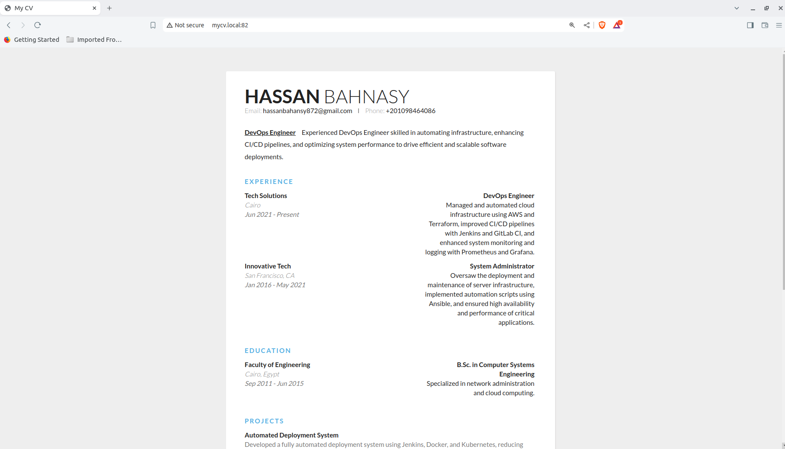

# **Task 03: Docker Installation, NGINX Setup, and Port Configuration**

   

## **Objective**
This task involves installing Docker on a Linux system, setting up a simple website using NGINX, and configuring NGINX to run on a non-default port (82).

## **Steps**

### 1. Install Docker using a Shell Script
A shell script `Docker.sh` was created to automate the installation of Docker. The script performs the following actions:

- Updates the apt package index and installs prerequisites for apt to use a repository over HTTPS.
- Adds Docker’s official GPG key and sets up the Docker repository.
- Installs Docker Community Edition (CE).
- Verifies the installation by running the `hello-world` Docker image.
- Optionally adds the current user to the Docker group to allow Docker commands without `sudo`.

**Script:**
```bash
#!/bin/bash

# Update the apt package index and install packages to allow apt to use a repository over HTTPS
sudo apt-get update
sudo apt-get install -y \
    apt-transport-https \
    ca-certificates \
    curl \
    software-properties-common

# Add Docker’s official GPG key
curl -fsSL https://download.docker.com/linux/ubuntu/gpg | sudo apt-key add -

# Add Docker repository
sudo add-apt-repository \
   "deb [arch=amd64] https://download.docker.com/linux/ubuntu \
   $(lsb_release -cs) \
   stable"

# Update the apt package index again
sudo apt-get update

# Install the latest version of Docker CE (Community Edition)
sudo apt-get install -y docker-ce

# Verify that Docker CE is installed correctly by running the hello-world image
sudo docker run hello-world

# Optional: Add the current user to the Docker group to run Docker commands without sudo
sudo usermod -aG docker $USER

echo "Docker installation completed. Please log out and log back in to use Docker without sudo."
```

### 2. Set Up a Website on NGINX

A website was created with the following files:

- **index.html**: Contains the basic structure and content for the CV.
- **styles.css**: Contains the styles for the CV.

These files are located in `/var/www/mycv/`.

**NGINX Configuration:**

The NGINX configuration was edited to listen on port 82 instead of the default port 80. A new server block was created in the `/etc/nginx/sites-available/mycv` configuration file:

```nginx
server {
    listen 82;
    server_name mycv.local;

    root /var/www/mycv;
    index index.html;

    location / {
        try_files $uri $uri/ =404;
    }

    location /styles.css {
        alias /var/www/mycv/styles.css;
    }
}
```

**Commands Used:**
- Test the configuration:
  ```bash
  sudo nginx -t
  ```
- Reload NGINX to apply changes:
  ```bash
  sudo nginx -s reload
  ```
- Enable the site by creating a symbolic link:
  ```bash
  sudo ln -s /etc/nginx/sites-available/mycv /etc/nginx/sites-enabled/
  ```

### 3. Verify the Setup

Once the NGINX server was configured, the website was accessible at `http://localhost:82`. The CV page was successfully displayed, showing the content and styles defined in the `index.html` and `styles.css` files.



### 4. Summary of Commands and Steps
- **Docker Installation:**
  - Automated using the `Docker.sh` script.
- **NGINX Setup:**
  - Configured to serve a website on port 82.
  - Tested and reloaded using `nginx -t` and `nginx -s reload`.
  - Site enabled through a symbolic link in the `sites-enabled` directory.

## Conclusion
This task demonstrates the installation of Docker using a script, setting up a basic NGINX server for a website, and modifying the server’s port configuration. These skills are essential for managing web services and containerized applications in a DevOps environment.

