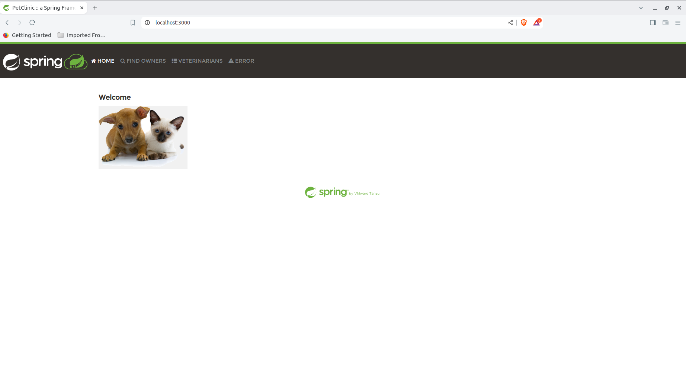
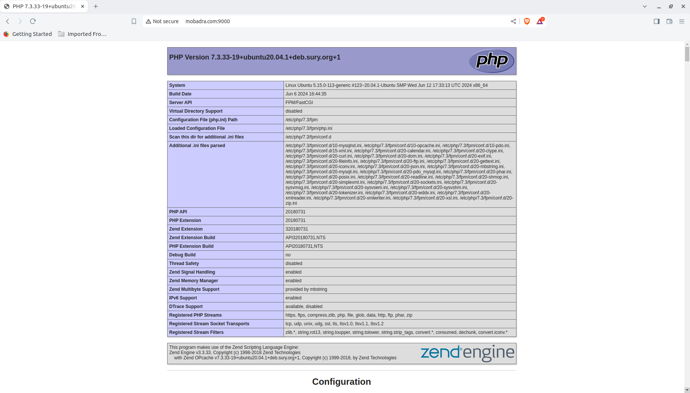

# **Task 04: Docker and NGINX Setup with PHP-FPM and Caching**

    

## **Objective**
This task involves setting up a Docker container for the Spring Petclinic Node.js application, configuring an NGINX server with PHP 7.3 and PHP-FPM, and setting up caching and gzip compression for static content.

## **Steps**

### 1. Docker Setup for Spring Petclinic Application

#### 1.1 Install Docker
For the Docker installation, you can use the `Docker.sh` script from Task 03: [Click here](https://github.com/Bahnasy2001/DEPI_DevOpsTasks/blob/main/Task03/Docker.sh)

#### 1.2 Clone the Spring Petclinic Repository
The Spring Petclinic application was cloned from the official repository:
```bash
git clone https://github.com/spring-projects/spring-petclinic.git
```

#### 1.3 Pull the Eclipse Temurin Docker Image
Pulled the Eclipse Temurin Docker image, which is optimized for running Java applications:
```bash
sudo docker pull eclipse-temurin
```

#### 1.4 Build and Run Docker Container
A Docker container was created to run the Spring Petclinic application:
```bash
sudo docker run -d --name spring_petclinic_eclipse -p 3000:8080 --restart always eclipse-temurin
```

#### 1.5 Copy Application Files into the Container
The Spring Petclinic application files were copied into the Docker container:
```bash
sudo docker cp spring-petclinic spring_petclinic_eclipse:/app
```

#### 1.6 Access the Container and Run the Application
The application was built and run inside the Docker container:
```bash
sudo docker exec -it spring_petclinic_eclipse /bin/bash
cd /app
./mvnw package
java -jar target/*.jar
```
The application is now accessible on port 3000.

### 2. NGINX and PHP-FPM Setup

#### 2.1 Install NGINX
To install NGINX, run the following commands:
```bash
sudo apt update
sudo apt install -y nginx
```

#### 2.2 Install PHP 7.3 and PHP-FPM
PHP 7.3 and PHP-FPM were installed to handle PHP processing within NGINX:
```bash
sudo apt-get install php7.3 php7.3-fpm
```

#### 2.3 Install Common PHP 7.3 Modules
Additional PHP modules were installed to enhance PHP’s functionality.

#### 2.4 NGINX Configuration for mobadra.com
The NGINX server was configured to serve the website on `mobadra.com` and listen for PHP-FPM on port 9000. The configuration file is located at `/etc/nginx/conf.d/mobadra.conf`:
```nginx
server {
    listen 9000;
    server_name mobadra.com;
    root /var/www/mobadra.com/html;

    index index.php index.html index.htm;

    location / {
        try_files $uri $uri/ =404;
    }

    location ~ \.php$ {
        include snippets/fastcgi-php.conf;
        fastcgi_pass unix:/var/run/php/php7.3-fpm.sock;
        fastcgi_param SCRIPT_FILENAME $document_root$fastcgi_script_name;
        include fastcgi_params;
    }

    location /static/ {
        root /var/www/mobadra.com/html;
        gzip on;
        gzip_types image/png image/jpeg image/gif;
        gzip_proxied any;
        gzip_vary on;

	expires 30d;
	add_header Cache-Control "public, must-revalidate, proxy-revalidate";
    }
}
```

#### 2.5 Create Virtual Host and PHP Info Page
A virtual host was created for `mobadra.com`, pointing to `/var/www/mobadra.com/html`. A `phpinfo` page was created to verify the PHP setup:
```php
<?php phpinfo(); ?>
```
The file is located at `/var/www/mobadra.com/html/index.php`.

### 3. Static Content Setup and Caching

#### 3.1 Create Static Directory and Upload Images
A static directory was created under `/var/www/mobadra.com/html/static/` to host images. Images were uploaded to this directory.

#### 3.2 Configure Gzip Compression
Gzip compression was enabled in the NGINX configuration to optimize the delivery of images and static content:
```nginx
gzip on;
gzip_types image/png image/jpeg image/gif;
gzip_proxied any;
gzip_vary on;
```

#### 3.3 Configure Caching for Static Content
Caching was set up for static content, with a cache expiry of 30 days:
```nginx
expires 30d;
add_header Cache-Control "public, must-revalidate, proxy-revalidate";
```

### 4. Verification and Testing

- **Docker Container:** The Spring Petclinic application was successfully deployed and accessible on `http://localhost:3000`.

- **NGINX Configuration:** Verified by accessing `http://mobadra.com:9000`, which correctly displayed the `phpinfo` page.

- **Static Content:** Verified that images were being served from `http://mobadra.com/static/image1.png` with gzip compression and caching headers.


## Conclusion
This task involved setting up a robust development environment with Docker, NGINX, PHP-FPM, and implementing efficient static content delivery through gzip compression and caching. The configurations ensure optimized performance and scalability of the web application.

