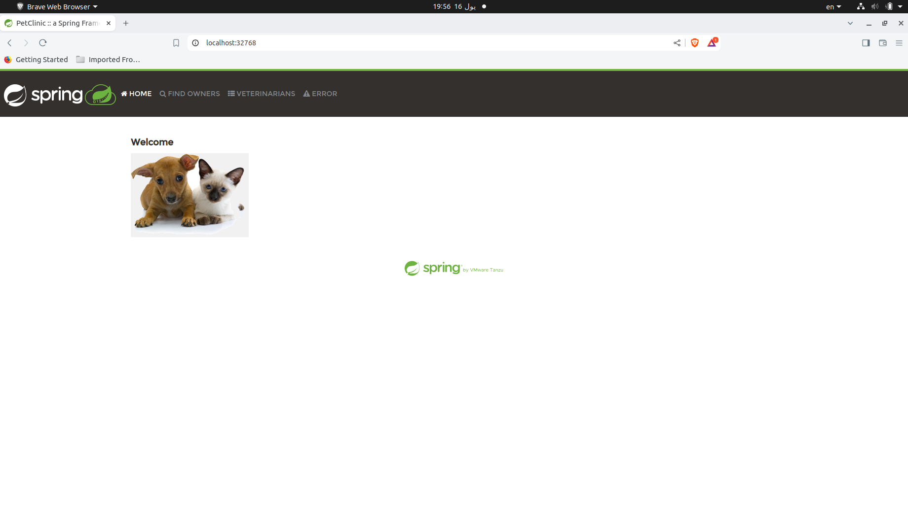

# **Task 06: Dockerfile Building Basics**

  

## **Overview**
In this task, we will create a Dockerfile to containerize the Spring Petclinic application, build the Docker image, and run the Docker container.

## **Steps**

### 1. Create the Dockerfile

- **Dockerfile Content**
```Dockerfile
FROM eclipse-temurin:latest

WORKDIR /app

COPY . .

EXPOSE 8080

RUN ./mvnw package

CMD ["/bin/sh", "-c","java -jar /app/target/*.jar"]

```

The Dockerfile is a script that contains a series of instructions to build a Docker image. Here’s what each line of the Dockerfile does:

```Dockerfile
FROM eclipse-temurin:latest
```
- **FROM**: This line specifies the base image. We're using `eclipse-temurin:latest`, which is a JDK (Java Development Kit) image based on OpenJDK, maintained by the Eclipse Adoptium project.

```Dockerfile
WORKDIR /app
```
- **WORKDIR**: This sets the working directory inside the container to `/app`. All subsequent instructions will be run within this directory.

```Dockerfile
COPY . .
```
- **COPY**: This command copies the content from your local directory to the `/app` directory inside the container.

```Dockerfile
EXPOSE 8080
```
- **EXPOSE**: This informs Docker that the container will listen on port `8080` at runtime.

```Dockerfile
RUN ./mvnw package
```
- **RUN**: This command runs the `mvnw package` command inside the container, which compiles the Spring Petclinic application and packages it into a JAR file.

```Dockerfile
CMD ["/bin/sh", "-c","java -jar /app/target/*.jar"]
```
- **CMD**: This command specifies the command to run when the container starts. It runs the Spring Petclinic application using the JAR file created in the previous step.

### 2. Build the Docker Image
To build the Docker image, use the following command:

```bash
sudo docker build -t spring_petclinic_eclipse .
```

- `-t spring_petclinic_eclipse`: Tags the image with the name `spring_petclinic_eclipse`.
- `.`: Refers to the current directory where the Dockerfile is located.

### 3. Run the Docker Container
After building the image, you can run a Docker container using the following command:

```bash
sudo docker run -d -P --name Task6 spring_petclinic_eclipse
```

- `-d`: Runs the container in detached mode (in the background).
- `-P`: Publishes all exposed ports to random ports on the host.
- `--name Task6`: Names the container `Task6`.
- `spring_petclinic_eclipse`: The name of the image to use for creating the container.

### 4. Result
The application will be running on a dynamically allocated port. You can access it through `http://localhost:<port>`, where `<port>` is the port assigned by Docker. For example, `http://localhost:32678`.

