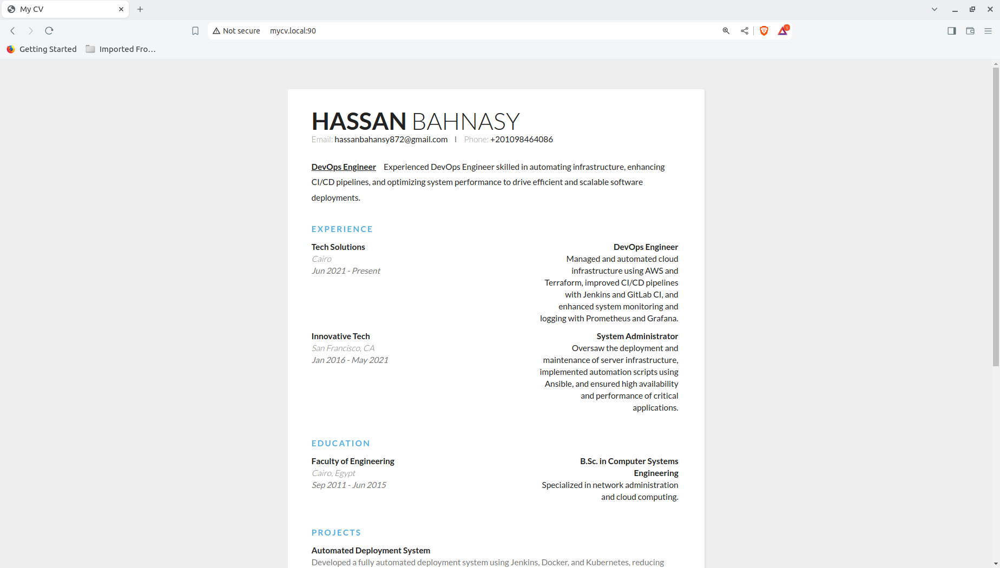
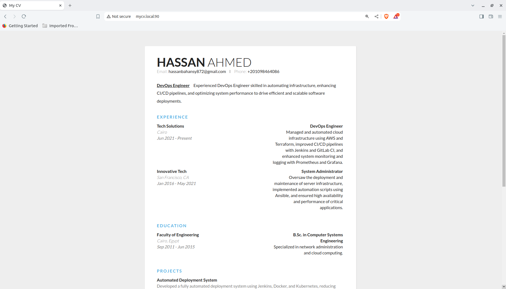
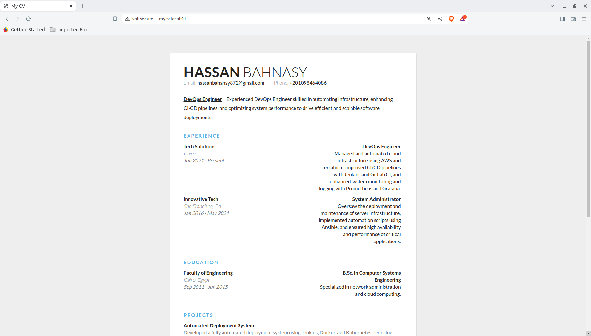

# Task 07: Docker Volumes using Nginx

   

## Overview
In this task, we set up an Nginx server to serve a CV application, use Docker bind mounts and volumes, and demonstrate how to manage and persist data across Docker containers.

## Prerequisites
- Docker installed on your system.
- Basic knowledge of Docker, Nginx, and HTML/CSS.

## Steps

### 1. Create the Dockerfile

The Dockerfile is used to build the Docker image for the Nginx server serving the CV application.

```Dockerfile
# Use the official Nginx image from the Docker Hub
FROM nginx:latest

# Copy the custom Nginx configuration file
COPY ./mycv.conf /etc/nginx/conf.d/mycv.conf

# Copy the CV application to the default Nginx directory
COPY ./index.html /usr/share/nginx/mycv/index.html
COPY ./styles.css /usr/share/nginx/mycv/styles.css

# Expose the port specified in the custom Nginx configuration file
EXPOSE 82
```

**Explanation:**
- **FROM nginx:latest:** Uses the latest Nginx image as the base image.
- **COPY:** Copies the custom Nginx configuration and CV application files into the appropriate directories in the container.
- **EXPOSE 82:** Exposes port 82, as configured in the Nginx configuration file.

### 2. Create the Nginx Configuration File (`mycv.conf`)

```nginx
server {
    listen 82;
    server_name mycv.local;

    root /usr/share/nginx/mycv;
    index index.html;

    location / {
        try_files $uri $uri/ =404;
    }

    location /styles.css {
        alias /usr/share/nginx/mycv/styles.css;
    }
}
```

**Explanation:**
- **listen 82;**: Configures Nginx to listen on port 82.
- **server_name mycv.local;**: The server name is set to `mycv.local`.
- **root /usr/share/nginx/mycv;**: Specifies the root directory for the server.
- **location /styles.css;**: Defines a location block to serve the CSS file.

### 3. Create the CV Application Files

Create an `index.html` file and a `styles.css` file with your CV details.

**Example `index.html`:**
```html
<!DOCTYPE html>
<html lang="en">
<head>
    <meta charset="UTF-8">
    <meta name="viewport" content="width=device-width, initial-scale=1.0">
    <title>My CV</title>
    <link href="https://fonts.googleapis.com/css?family=Lato:400,300,700" rel="stylesheet" type="text/css">
    <link rel="stylesheet" href="styles.css">
</head>
<body>
    <div class="container">
        <div class="header">
            <div class="full-name">
                <span class="first-name">Hassan</span> 
                <span class="last-name">Ahmed</span>
            </div>
            <!-- Rest of the content -->
        </div>
    </div>
</body>
</html>
```

**Example `styles.css`:**
```css
body {
    font-family: 'Lato', sans-serif;
    background: #eee;
}
.container {
    max-width: 700px;
    margin: 50px auto;
    padding: 40px;
    background: #fff;
    box-shadow: 1px 1px 2px #DAD7D7;
}
```

### 4. Build and Run the Docker Container with Bind Mount

```bash
docker build -t mycv-nginx .
docker run -d -p 90:82 --name mycv-container -v /home/bahnasy/Desktop/DEPI/DEPI DevOpsTasks/Task7/mycv:/usr/share/nginx/mycv mycv-nginx
```

**Explanation:**
- **docker build -t mycv-nginx .**: Builds the Docker image and tags it as `mycv-nginx`.
- **docker run -d -p 90:82 --name mycv-container -v /home/bahnasy/Desktop/DEPI/DEPI DevOpsTasks/Task7/mycv:/usr/share/nginx/mycv mycv-nginx**: Runs the container with a bind mount, mapping the host directory to the container directory.

### 5. Access the Application

Add the following entry to your `/etc/hosts` file:

```
127.0.0.1 mycv.local
```

Access the application in your browser at `http://mycv.local:90`.

**Before Change**


**After Change index.html**


### 6. Create and Use Docker Volumes

#### 6.1 Create a Docker Volume

```bash
docker volume create mycv-volume
```

#### 6.2 Run a Docker Container Using the Volume

```bash
docker run -d -p 91:82 --name mycv-container-two -v mycv-volume:/usr/share/nginx/mycv mycv-nginx
```

**Explanation:**
- **docker volume create mycv-volume**: Creates a Docker volume named `mycv-volume`.
- **docker run -d -p 91:82 --name mycv-container-two -v mycv-volume:/usr/share/nginx/mycv mycv-nginx**: Runs the container using the created Docker volume.

#### 6.3 Verify the Volume Data

```bash
sudo ls /var/lib/docker/volumes/mycv-volume/_data
```

Access the application in your browser at `http://mycv.local:91`.


## Conclusion

In this task, you learned how to build a Docker image for an Nginx server, use bind mounts to mount directories, create and use Docker volumes, and manage data persistence across Docker containers.
