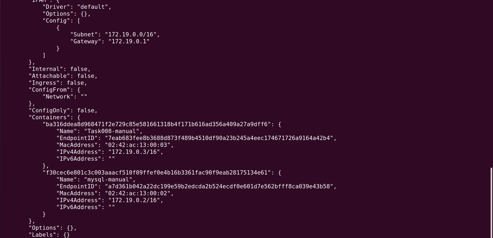
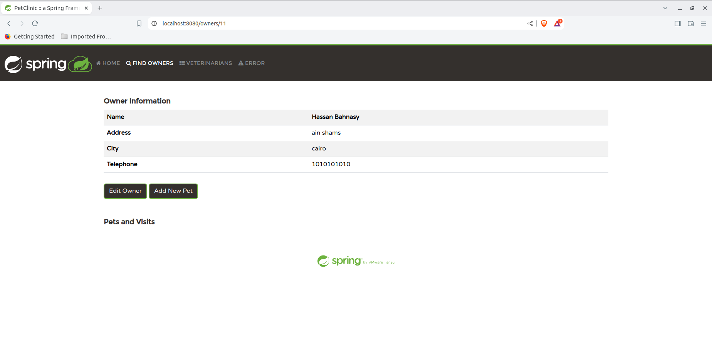

# Task 08: Docker Networking Manual and Using Docker Compose


  

## Overview
In this task, we connect the Spring Petclinic application with a MySQL database using Docker. This task is divided into two parts: manual Docker networking and using Docker Compose. This demonstrates how to manage multi-container applications and network them together effectively.

## Prerequisites

- Docker installed on your machine.
- Docker Compose installed.

## Part 1: Manual Docker Networking

### Step 1: Create a Docker Network

To allow the containers to communicate, create a Docker network:

```bash
docker network create spring-net
```

### Step 2: Run MySQL Container

Run the MySQL container connected to the `spring-net` network:

```bash
docker run -e MYSQL_USER=petclinic -e MYSQL_PASSWORD=petclinic -e MYSQL_ROOT_PASSWORD=root -e MYSQL_DATABASE=petclinic --network spring-net --name mysql-manual -v mysql-manual-volume:/var/lib/mysql -p 3307:3306 mysql
```

### Step 3: Run Spring Petclinic Container

Run the Spring Petclinic application, connecting it to the MySQL container:

```bash
docker run -e MYSQL_URL=jdbc:mysql://mysql-manual:3306/petclinic -e SPRING_PROFILES_ACTIVE=mysql --network spring-net -p 8080:8080 --name Task008-manual spring_petclinic_eclipse
```

### Testing the Setup

Use Command `docker network inspect spring-net` to know ipv4Address (172.17.0.3)

Access the application via `http://172.17.0.3:8080` and interact with the MySQL database.

## Part 2: Docker Compose

Docker Compose is a tool that allows you to define and manage multi-container Docker applications. Instead of manually setting up and connecting containers, Docker Compose automates this process by defining everything in a `docker-compose.yml` file.

### Step 1: Create Docker Compose File

Create a `docker-compose.yml` file with the following content:

```yaml
version: '3.8'

services:
  db:
    image: mysql:latest
    container_name: petclinic-db
    environment:
      MYSQL_ROOT_PASSWORD: rootpassword
      MYSQL_DATABASE: petclinic
      MYSQL_USER: petclinic
      MYSQL_PASSWORD: petclinicpassword
    ports:
      - "3306"
    volumes:
      - db_data:/var/lib/mysql

  app:
    build: .
    container_name: petclinic-app
    environment:
      - MYSQL_URL=jdbc:mysql://db:3306/petclinic
      - MYSQL_USER=petclinic
      - MYSQL_PASS=petclinicpassword
      - SPRING_PROFILES_ACTIVE=mysql
    ports:
      - "8080:8080"
    depends_on:
      - db

volumes:
  db_data:
```

### Explanation of the Docker Compose File

- **version: '3.8'**: Specifies the version of Docker Compose syntax being used.
  
- **services**: Defines the services (containers) that will be run.
  
  - **db**: Defines the MySQL service.
    - **image: mysql:latest**: Specifies the MySQL image to be used.
    - **container_name: petclinic-db**: Names the container `petclinic-db`.
    - **environment**: Sets environment variables for the MySQL service, including the root password, database name, and user credentials.
    - **ports**: Exposes port 3306, the default MySQL port, to the host.
    - **volumes**: Mounts a volume named `db_data` to persist MySQL data across container restarts.
  
  - **app**: Defines the Spring Petclinic application service.
    - **build: .**: Specifies that the Dockerfile in the current directory should be used to build the image.
    - **container_name: petclinic-app**: Names the container `petclinic-app`.
    - **environment**: Sets environment variables for connecting the Spring Petclinic application to the MySQL database.
    - **ports**: Maps port 8080 from the container to the host, allowing access to the application.
    - **depends_on**: Ensures that the `db` service (MySQL) starts before the application, ensuring proper initialization.

- **volumes**: Defines the volume `db_data` to persist MySQL data.

### Step 2: Start Services with Docker Compose

Start the services using Docker Compose:

```bash
docker-compose up
```

This command will automatically:

1. Pull the necessary images (MySQL in this case).
2. Build the Spring Petclinic application image if it doesn't already exist.
3. Start both containers (`petclinic-db` and `petclinic-app`) and connect them to the same network.

### Testing the Setup

- Access the application via `http://localhost:8080`.
- Add data to the application.
- Use `docker-compose down` (or `docker stop container` in the manual case) and then start the service again with `docker-compose up` (or `docker start container`). The data should persist.


## Conclusion

This task demonstrates how to connect multiple containers using Docker networking both manually and using Docker Compose. Docker Compose simplifies the management of multi-container applications, making it easier to define, run, and maintain complex setups.
