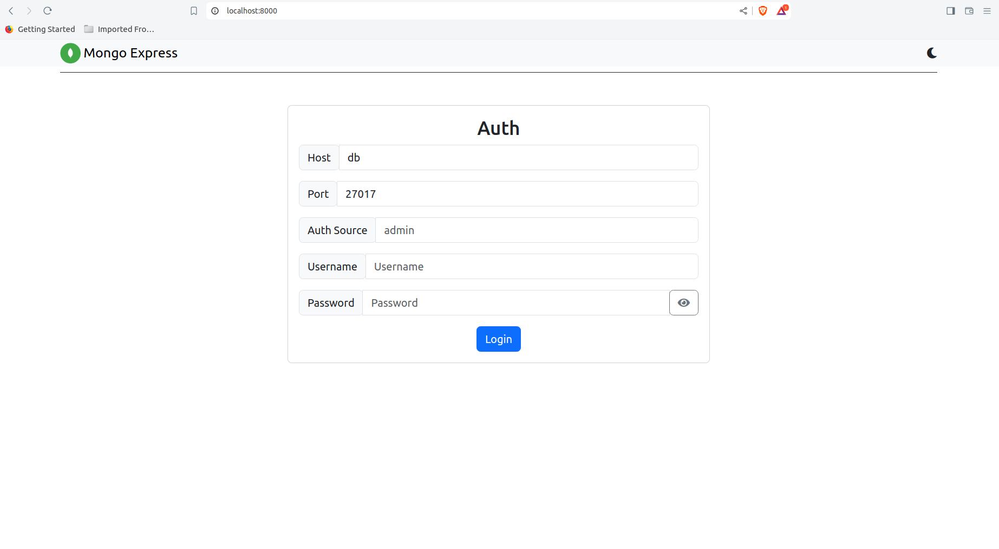
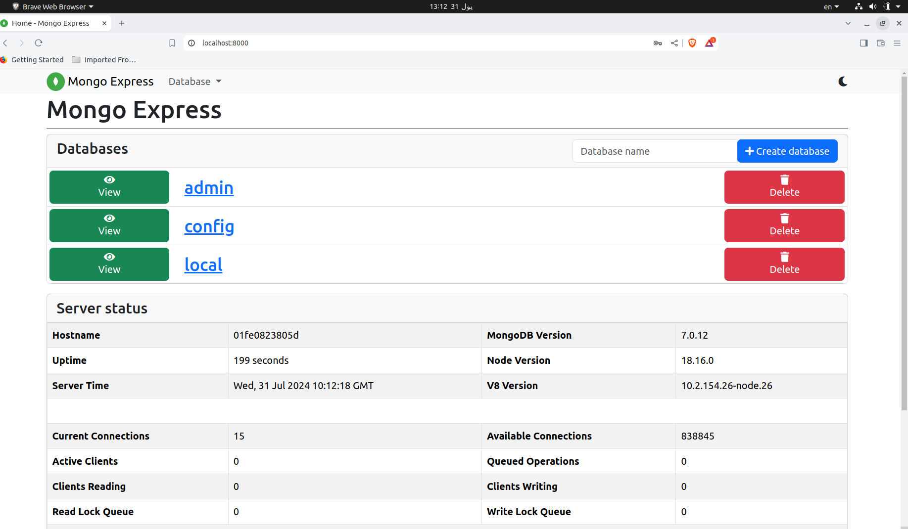

# Task 10: Two Complete Applications Using Load Balancer and Docker Compose

   


This task demonstrates how to Dockerize two complete applications—**Spring Petclinic** and **mongo-express**—and manage them using Docker Compose. Additionally, we use **Nginx** as a load balancer to distribute traffic across multiple replicas of these applications.

## Overview

This task is divided into two parts:

1. **Spring Petclinic**: A Spring Boot application connected to a MySQL database, with Nginx serving as a load balancer.
2. **mongo-express**: A web-based MongoDB admin interface, with MongoDB as the backend, also balanced by Nginx.

## Part 1: Spring Petclinic

### Dockerfile

This Dockerfile uses a multistage build to create separate environments for development and production. Here’s a breakdown:

1. **Stage 1: Build the Application**
   - **Base Image**: We use the `eclipse-temurin` image to build the Java application.
   - **Working Directory**: Set to `/app`.
   - **COPY**: All files are copied to the container.
   - **RUN**: Maven is used to package the application.

2. **Stage 2: Development Environment**
   - **Base Image**: Same as the builder stage.
   - **COPY**: The built application from Stage 1 is copied.
   - **EXPOSE**: Port 8080 is exposed.
   - **CMD**: Runs the Spring Petclinic application.

3. **Stage 3: Production Environment**
   - **Base Image**: Same as the development stage.
   - **COPY**: The built application from Stage 1 is copied.
   - **EXPOSE**: Port 8080 is exposed.
   - **CMD**: Runs the Spring Petclinic application.

### Docker Compose and Nginx Configuration

**docker-compose-nginx.yml** manages the services and configures Nginx as a load balancer.

- **db Service**:
  - Uses the official MySQL image.
  - Exposes port 3306 for MySQL connections.
  - Environment variables set up the database.
  - Data persistence is handled via Docker volumes.

- **app Service**:
  - Builds the application using the Dockerfile.
  - The service deploys 4 replicas to balance the load.
  - Depends on the `db` service for the database connection.

- **nginx Service**:
  - Uses the Nginx image.
  - Configured to listen on port 7000 and proxy requests to the `app` service.
  - The Nginx configuration is stored in a local directory (`conf.d`) and mounted into the container.

**nginx.conf**:
```nginx
server {
    listen 80;
    location / {
        proxy_pass http://app:8080;
    }
}
```
This configuration file tells Nginx to forward all incoming requests on port 80 to the `app` service running on port 8080.

### Running the Application

To build and run the services:

```bash
docker compose -f docker-compose.yml -f docker-compose-nginx.yml up --build
```

This command builds the application and starts all services, including the database and load balancer.

## Part 2: mongo-express

### Dockerfile

This Dockerfile builds the mongo-express application in two stages:

1. **Stage 1: Build the Application**
   - **Base Image**: `node:18-alpine3.16`.
   - **COPY**: All files to the working directory.
   - **RUN**: Installs dependencies and builds the application.

2. **Stage 2: Production Environment**
   - **Base Image**: `node:18-alpine3.16`.
   - **COPY**: Copies the built application from Stage 1.
   - **ENV**: Configures environment variables for MongoDB connection and server settings.
   - **EXPOSE**: Exposes port 8081 for the application.
   - **CMD**: Starts the application using `tini` to manage the process.

### Docker Compose and Nginx Configuration

**docker-compose.yml** manages the mongo-express and MongoDB services, with Nginx as a load balancer.

- **db Service**:
  - Uses the official MongoDB image.
  - Exposes port 27017 for MongoDB connections.
  - Environment variables set up the database and root user.

- **app Service**:
  - Builds the mongo-express application using the Dockerfile.
  - Deploys 4 replicas to balance the load.
  - Depends on the `db` service for the MongoDB connection.

- **nginx Service**:
  - Uses the Nginx image.
  - Configured to listen on port 8000 and proxy requests to the `app` service.
  - The Nginx configuration is stored in a local directory (`conf.d`) and mounted into the container.

**nginx.conf**:
```nginx
server {
    listen 80;

    location / {
        proxy_pass http://app:8081;
        proxy_set_header Host $host;
        proxy_set_header X-Real-IP $remote_addr;
        proxy_set_header X-Forwarded-For $proxy_add_x_forwarded_for;
        proxy_set_header X-Forwarded-Proto $scheme;
    }
}
```
This configuration file tells Nginx to forward all incoming requests on port 80 to the `app` service running on port 8081.

### Running the Application

To build and run the services:

```bash
docker compose -f docker-compose.yml up --build
```

This command builds the application and starts all services, including the database and load balancer.



