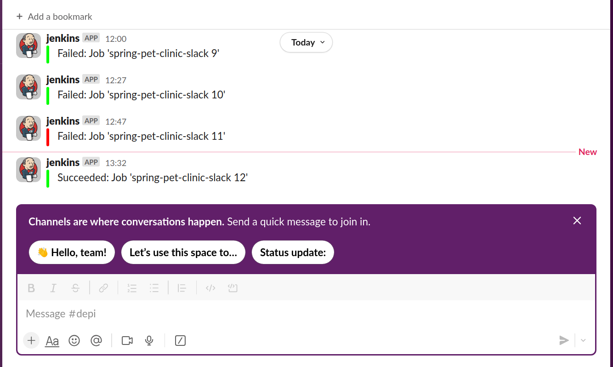
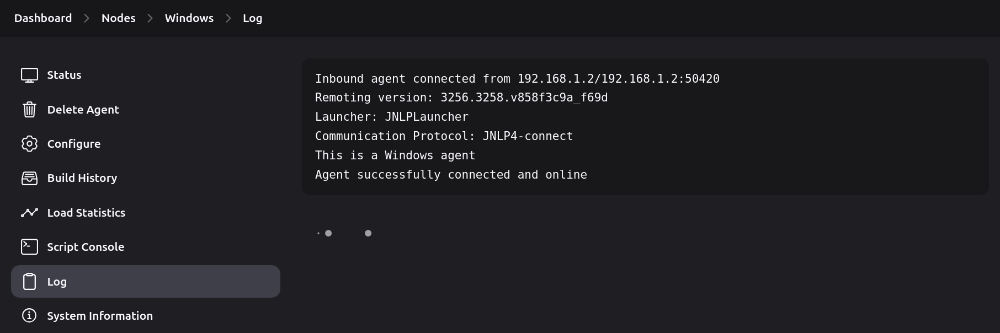
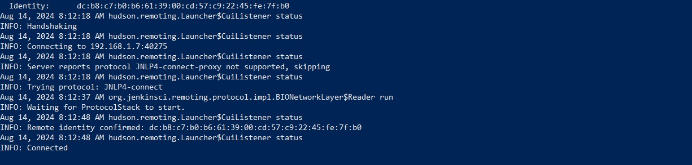

# Task 14: Advanced Jenkins Pipeline Configuration

    

## Overview
This task involves creating and configuring Jenkins pipelines with advanced features such as agent usage, parameterization, Slack notifications, webhook integration using ngrok, and setting up a Jenkins agent on Windows.

## 1. Create a Pipeline with Agent

This pipeline uses a Docker agent to build and run the Spring Petclinic application. The Jenkinsfile is as follows:

```groovy
pipeline {
    agent { label 'docker' }
    
    stages {
        stage('preparation') {
            steps {
                // Clone the repository
                git(
                    url: 'https://github.com/Bahnasy2001/spring-pet-clinic',
                    branch: 'main'
                )
            }
        }
        stage('ci') {
            steps {
                withCredentials([usernamePassword(credentialsId: 'dockerhub', usernameVariable: 'USERNAME', passwordVariable: 'PASSWORD')]) {
                    // Build Docker image
                    sh 'docker build . -t hassanbahnasy/spring-pet-clinic'
                    
                    // Log in to Docker Hub
                    sh 'echo $PASSWORD | docker login -u $USERNAME --password-stdin'
                    
                    // Push Docker image to Docker Hub
                    sh 'docker push hassanbahnasy/spring-pet-clinic'
                }
            }
        }
        stage('cd') {
            steps {
                sh 'docker run -d -P --name spring-agent hassanbahnasy/spring-pet-clinic'
            }
        }
    }
}
```

### Explanation:
- **Agent:** Specifies the Docker agent for running the stages.
- **Stages:** Consists of three stages—preparation (cloning the repository), CI (building and pushing the Docker image), and CD (running the Docker container).

## 2. Create a Pipeline with Parameters

This pipeline includes parameters to allow for different environment configurations (e.g., `dev`, `prod`, `nginx`).

```groovy
pipeline {
    agent { label 'docker' }
    parameters {
        choice(choices: ['dev', 'prod', 'nginx'], name: 'environment')
    }
    stages {
        stage('preparation') {
            steps {
                // Clone the repository
                git(
                    url: 'https://github.com/Bahnasy2001/spring-pet-clinic',
                    branch: 'main'
                )
            }
        }
        stage('cd') {
            steps {
                echo "Environment parameter: ${params.environment}"
                sh "docker compose -f docker-compose.yml -f docker-compose-${params.environment}.yml down --remove-orphans"
                sh "docker compose -f docker-compose.yml -f docker-compose-${params.environment}.yml up -d --build"
            }
        }
    }
    post {
        success {
            slackSend(channel: "depi", color: '#00FF00', message: "Succeeded: Job '${env.JOB_NAME} ${env.BUILD_NUMBER}'")
        }
        failure {
            slackSend(channel: "depi", color: '#FF0000', message: "Failed: Job '${env.JOB_NAME} ${env.BUILD_NUMBER}'")
        }
    }
}
```

### Explanation:
- **Parameters:** Allows selection of the environment to deploy.
- **Slack Notifications:** Sends success or failure messages to a Slack channel.

## 3. Create a Pipeline with Slack Notification

The Slack notification functionality is integrated into the pipeline, sending updates about the build status to a Slack channel.

### How to Add Slack to Jenkins:
1. **Install Slack Plugin:**
   - Navigate to **Manage Jenkins > Manage Plugins**.
   - Search for and install the "Slack Notification" plugin.

2. **Configure Slack:**
   - Go to **Manage Jenkins > Configure System**.
   - In the Slack section, add your **Workspace**, **Credentials**, and **Channel**.

3. **Create Slack Credentials:**
   - Create a new "Secret Text" credential in Jenkins with your Slack token.

### Role of Slack:
- Slack is used to notify the team about the build status, helping maintain communication and ensuring quick responses to any build issues.



## 4. Create a Pipeline with Webhook

### Setting Up Webhook with ngrok:

- ngrok: Ngrok is used for exposing Jenkins to the internet, allowing you to set up webhooks from GitHub. You can download and install ngrok

1. **Start ngrok:**
   ```bash
   ngrok http 8080
   ```
   - Note the forwarding URL provided by ngrok.

2. **Set Up Webhook in GitHub:**
   - Go to your GitHub repository settings and navigate to **Webhooks**.
   - Add a new webhook with the ngrok forwarding URL and set the content type to `application/json`.

3. **Webhook in Jenkins:**
   - Configure the Jenkins project to trigger builds when a webhook event occurs.

## 5. Create an Agent on Windows

### Steps to Create Jenkins Agent on Windows:
1. **Configure Jenkins:**
   - On your Ubuntu-based Jenkins server, generate a command to connect the Windows agent.
   - Use the Windows machine's IP address instead of `localhost`.

2. **Run the Command on Windows:**
   - On your Windows machine, open a terminal and run the command provided by Jenkins to connect the agent.
   




## Conclusion

This task demonstrates the advanced capabilities of Jenkins pipelines, including agent configuration, parameterized builds, Slack notifications, and webhook integration. By following these steps, you can automate and streamline your CI/CD pipeline, ensuring efficient and reliable deployments. The ability to create a Jenkins agent on a Windows machine also highlights Jenkins' flexibility in different environments.
