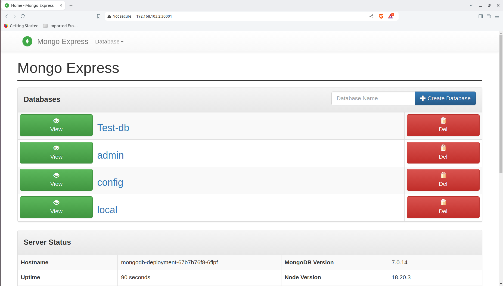

### Task 17: MongoDB and Mongo Express Deployment on Kubernetes

   

### Description:
This task involves deploying MongoDB and Mongo Express on a Kubernetes cluster. The setup includes the creation of ConfigMaps, Secrets, Persistent Volumes, Persistent Volume Claims, Deployments, and Services. The MongoDB database is accessed through a ClusterIP service, while Mongo Express is exposed using a LoadBalancer service.

**Folder Structure:**
```bash
DemoProject/
├── configmaps
│   └── mongodb-configmap.yaml
├── deployments
│   ├── mongodb-deployment.yaml
│   └── mongoexpress-deployment.yaml
├── secrets
│   └── mongodb-secret.yaml
├── services
│   ├── mongodb-service.yaml
│   └── mongoexpress-service.yaml
├── Task17_Part1.png
├── Task17_Part2.png
└── volumes
    ├── mongodb-pvc.yaml
    └── mongodb-pv.yaml
```

### Steps:

1. **ConfigMap:**
   - Defines the database URL for MongoDB service.
   - File: `mongodb-configmap.yaml`

2. **Secrets:**
   - Stores the root username and password for MongoDB as base64 encoded values.
   - File: `mongodb-secret.yaml`

3. **Persistent Volume and Persistent Volume Claim:**
   - Defines a persistent storage solution for MongoDB data using local storage.
   - Files: `mongodb-pv.yaml`, `mongodb-pvc.yaml`

4. **Deployments:**
   - MongoDB deployment is configured to use the secret values for credentials and connects to the persistent storage.
   - Mongo Express deployment is linked to MongoDB via the ConfigMap and exposed for external access.
   - Files: `mongodb-deployment.yaml`, `mongoexpress-deployment.yaml`

5. **Services:**
   - MongoDB is exposed using a ClusterIP service, allowing internal communication.
   - Mongo Express is exposed using a LoadBalancer service, allowing access to the web interface.
   - Files: `mongodb-service.yaml`, `mongoexpress-service.yaml`

### How to Deploy:
1. Apply the ConfigMap:
   ```bash
   kubectl apply -f configmaps/mongodb-configmap.yaml
   ```

2. Apply the Secrets:
   ```bash
   kubectl apply -f secrets/mongodb-secret.yaml
   ```

3. Create Persistent Volumes and Claims:
   ```bash
   kubectl apply -f volumes/mongodb-pv.yaml
   kubectl apply -f volumes/mongodb-pvc.yaml
   ```

4. Deploy MongoDB and Mongo Express:
   ```bash
   kubectl apply -f deployments/mongodb-deployment.yaml
   kubectl apply -f deployments/mongoexpress-deployment.yaml
   ```

5. Expose Services:
   ```bash
   kubectl apply -f services/mongodb-service.yaml
   kubectl apply -f services/mongoexpress-service.yaml
   ```

### Images:
- `Task17_Part1.png`: MongoDB Deployment Output.
- `Task17_Part2.png`: Mongo Express Service Output.


