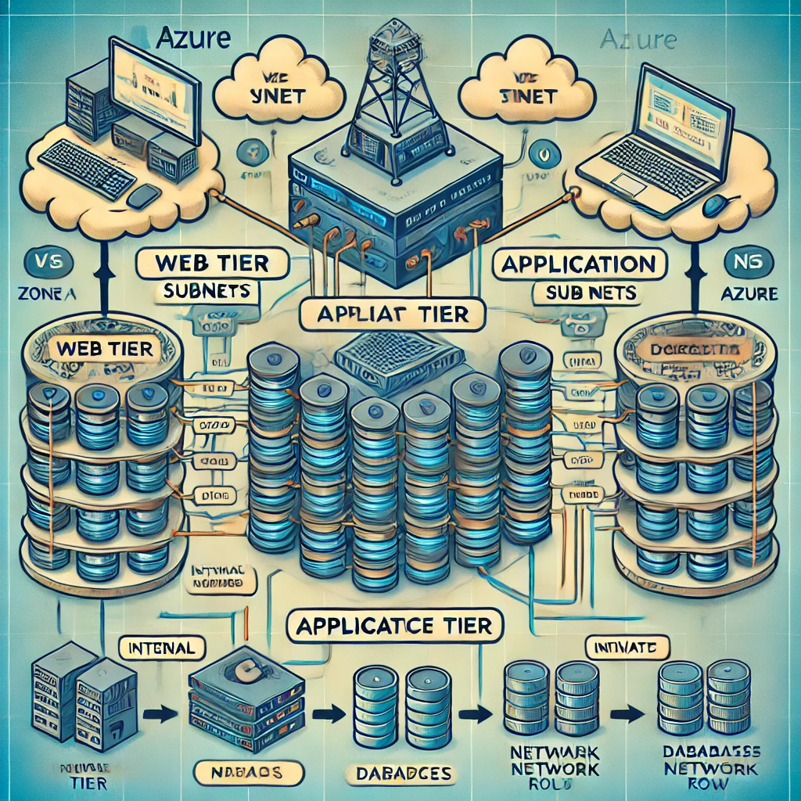
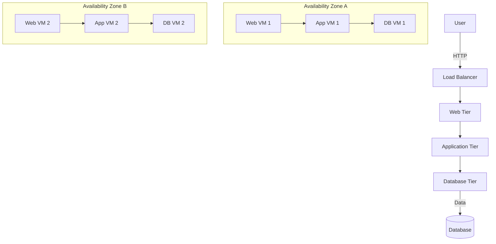

# Task 19: Azure 3-Tier Architecture with Terraform

   

## Project Overview

This project provisions a **highly available 3-tier architecture** on Azure using Terraform. The architecture consists of:
1. **Web Tier** (Front-End): Exposed to the internet and communicates with the Application Tier.
2. **Application Tier** (Back-End): Not exposed to the internet, has internet access via NAT, and communicates with the Database Tier.
3. **Database Tier**: Not exposed to the internet, responsible for data storage.

The infrastructure is designed with high availability by utilizing Azure's **Availability Zones** for redundancy.

## Architecture Diagram





## Infrastructure Components

- **Azure Virtual Network (VNet)**: The main network that hosts all resources.
- **Subnets**: Separate subnets for each tier, distributed across two availability zones for redundancy.
  - Web subnet
  - Application subnet
  - Database subnet
- **Network Security Groups (NSG)**: Restrict traffic between tiers and the internet.
- **Azure Load Balancer**: Distributes traffic across the web servers for high availability.
- **Linux Virtual Machines**: Virtual machines for each tier (Web, Application, Database) running Linux.
- **Azure Public IP**: Exposes the Load Balancer to the internet.
- **Managed Disks**: Persistent storage for each virtual machine.
- **NAT Gateway**: Provides internet access to private VMs in the Application and Database Tiers.
- **Availability Zones**: Ensures redundancy and high availability of resources across two zones.

## Prerequisites

Before you begin, make sure you have the following:

- An active Azure account.
- [Terraform](https://www.terraform.io/downloads.html) installed.
- Azure CLI installed and authenticated (`az login`).
- Appropriate Azure subscription limits (check for VM core quotas).

## Folder Structure

```bash
├── main.tf              # Main entry point for the Terraform script
├── variables.tf         # Input variables for customizing infrastructure
├── outputs.tf           # Outputs like IP addresses of the VMs
├── providers.tf         # Azure provider configuration
├── modules/
│   ├── vpc/             # VNet and subnets configuration
│   ├── web-tier/        # Web tier resources (VMs, NSGs, etc.)
│   ├── app-tier/        # Application tier resources
│   ├── db-tier/         # Database tier resources
└── README.md            # This file
```

## Usage

### 1. Clone the Repository

```bash
git clone https://github.com/your-repo/azure-3tier-architecture.git
cd azure-3tier-architecture
```

### 2. Initialize Terraform

Run the following command to initialize Terraform and download the necessary providers:

```bash
terraform init
```

### 3. Modify Variables

Update the `variables.tf` file or pass custom values when running the `terraform apply` command.

```bash
# Example of variable customization
variable "location" {
  default = "westeurope"
}

variable "vm_size" {
  default = "Standard_B2s"
}
```

### 4. Plan the Infrastructure

Use `terraform plan` to preview the infrastructure changes.

```bash
terraform plan
```

### 5. Apply the Configuration

Apply the Terraform configuration to deploy the infrastructure.

```bash
terraform apply
```

### 6. Access the Resources

Once the deployment is complete, you can access the public IP of the web tier and other outputs by running:

```bash
terraform output
```

## Clean Up

To destroy the infrastructure and avoid unnecessary charges:

```bash
terraform destroy
```

## Troubleshooting

- **Quota Errors**: If you run into quota errors like "Operation could not be completed as it results in exceeding approved standardBSFamily Cores quota," request an increase through the Azure portal.
- **NIC Issues**: You may encounter `NicReservedForAnotherVm` errors. In this case, wait for the Azure system to release the resources, then retry the operation.

## Future Improvements

- Add monitoring and logging with Azure Monitor.
- Automate scaling with Azure Scale Sets.
